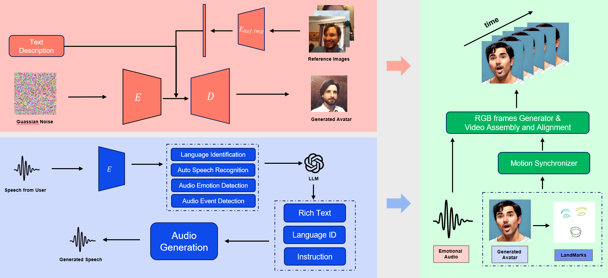
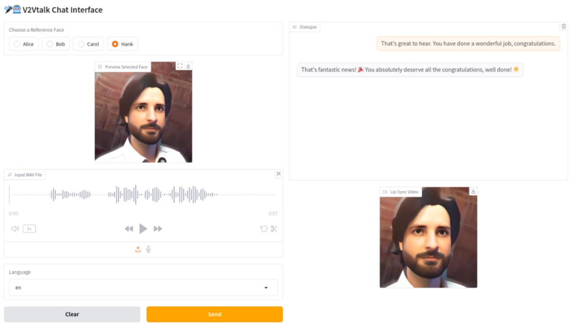

<h1 align='center'>Talking to Yourself: A Real-Time Framework for Personalized,
 Emotionally-Aware Multimodal Generation</h1>

T2Y is an integrated emotion-aware AI system that enables real-time emotional interaction through customized avatars. It combines personalized text-to-image generation, LLM-based emotion analysis, expressive speech synthesis, and dynamic video rendering. By leveraging multimodal inputs—text, audio, and visual cues—the system creates emotionally engaging avatar conversations with lifelike expressiveness and responsiveness, enhancing user experience and empathy in digital interactions.

<div align="center">  

</div>

## ⚒️ Installation

### Download the Codes

```bash
  git clone https://github.com/BadToBest/EchoMimic
  cd T2Vtalk
```

### Python Environment Setup

- Tested System Environment: Centos 7.2/Ubuntu 22.04, Cuda >= 11.7
- Tested GPUs: A100(80G) / RTX4090D (24G) / V100(16G)
- Tested Python Version: 3.8 / 3.10 / 3.11

Create conda environment (Recommended):

```bash
  conda create -n T2Vtalk python=3.10
  conda activate T2Vtalk
```

Install packages with `pip`
```bash
  pip install -r requirements.txt
```

### Download ffmpeg-static
Download and decompress [ffmpeg-static](https://www.johnvansickle.com/ffmpeg/old-releases/ffmpeg-4.4-amd64-static.tar.xz), then
```
export FFMPEG_PATH=/path/to/ffmpeg-4.4-amd64-static
```

### Download pretrained weights

**textual_inversion**

```shell
cd textual_inversion/
mkdir -p models/ldm/text2img-large/
wget -O models/ldm/text2img-large/model.ckpt https://ommer-lab.com/files/latent-diffusion/nitro/txt2img-f8-large/model.ckpt
```

The **models** is organized as follows.

```
./textual_inversion/
└──models
    └── ldm
        └── text2img-large
```

**SenseVoice**

```shell
cd SenseVoice/pretrained_models/
pip install modelscope
modelscope download --model_id iic/SenseVoiceSmall
modelscope download --model_id iic/speech_fsmn_vad_zh-cn-16k-common-pytorch
```

The **pretrained_models** is organized as follows.

```
./echomimic/
└──pretrained_models
    ├── SenseVoiceSmall
    │   └── ...
    └── speech_fsmn_vad_zh-cn-16k-common-pytorch
        └── ...
```

**CosyVoice**

```shell
cd CosyVoice/
git lfs install
mkdir -p pretrained_models
git clone https://www.modelscope.cn/iic/CosyVoice2-0.5B.git pretrained_models/CosyVoice2-0.5B
git clone https://www.modelscope.cn/iic/CosyVoice-300M.git pretrained_models/CosyVoice-300M
git clone https://www.modelscope.cn/iic/CosyVoice-300M-25Hz.git pretrained_models/CosyVoice-300M-25Hz
git clone https://www.modelscope.cn/iic/CosyVoice-300M-SFT.git pretrained_models/CosyVoice-300M-SFT
git clone https://www.modelscope.cn/iic/CosyVoice-300M-Instruct.git pretrained_models/CosyVoice-300M-Instruct
git clone https://www.modelscope.cn/iic/CosyVoice-ttsfrd.git pretrained_models/CosyVoice-ttsfrd
```

Optionally, you can unzip `ttsfrd` resouce and install `ttsfrd` package for better text normalization performance.

Notice that this step is not necessary. If you do not install `ttsfrd` package, we will use WeTextProcessing by default.

``` sh
cd CosyVoice/pretrained_models/CosyVoice-ttsfrd/
unzip resource.zip -d .
pip install ttsfrd_dependency-0.1-py3-none-any.whl
pip install ttsfrd-0.4.2-cp310-cp310-linux_x86_64.whl
```

The **pretrained_models** is organized as follows.

```
./CosyVoice/
└──pretrained_models
    ├── CosyVoice-300M
    │   └── ...
    ├── CosyVoice-300M-25Hz
    │   └── ...
    ├── CosyVoice-300M-Instruct
    │   └── ...
    ├── CosyVoice-300M-SFT
    │   └── ...
    ├── CosyVoice-ttsfrd
    │   └── ...
    └── CosyVoice2-0.5B
        └── ...
```

**echomimic**

```shell
cd echomimic/pretrained_weights/
git lfs install
git clone https://huggingface.co/BadToBest/EchoMimic pretrained_weights
```

The **pretrained_weights** is organized as follows.

```
./echomimic/
└──pretrained_weights
    ├── denoising_unet.pth
    ├── reference_unet.pth
    ├── motion_module.pth
    ├── face_locator.pth
    ├── sd-vae-ft-mse
    │   └── ...
    ├── sd-image-variations-diffusers
    │   └── ...
    └── audio_processor
        └── whisper_tiny.pt
```

In which **denoising_unet.pth** / **reference_unet.pth** / **motion_module.pth** / **face_locator.pth** are the main checkpoints of **EchoMimic**. Other models in this hub can be also downloaded from it's original hub, thanks to their brilliant works:
- [sd-vae-ft-mse](https://huggingface.co/stabilityai/sd-vae-ft-mse)
- [sd-image-variations-diffusers](https://huggingface.co/lambdalabs/sd-image-variations-diffusers)
- [audio_processor(whisper)](https://openaipublic.azureedge.net/main/whisper/models/65147644a518d12f04e32d6f3b26facc3f8dd46e5390956a9424a650c0ce22b9/tiny.pt)

## &#x1F680; Usage

### WebUI

```shell
python webui.py
```

<div align="center"> </div>

### Image Generation

**Inversion**

To invert an image set, in `textual_inversion` folder, run:

```
python main.py --base configs/latent-diffusion/txt2img-1p4B-finetune.yaml 
               -t 
               --actual_resume /path/to/pretrained/model.ckpt 
               -n <run_name> 
               --gpus 0, 
               --data_root /path/to/directory/with/images
               --init_word <initialization_word>
```

where the initialization word should be a single-token rough description of the object (e.g., 'toy', 'painting', 'sculpture'). If the input is comprised of more than a single token, you will be prompted to replace it.

**Generation**

To generate new images of the learned concept, in `textual_inversion` folder, run:
```
python scripts/txt2img.py --ddim_eta 0.0 
                          --n_samples 8 
                          --n_iter 2 
                          --scale 10.0 
                          --ddim_steps 50 
                          --embedding_path /path/to/logs/trained_model/checkpoints/embeddings_gs-5049.pt 
                          --ckpt_path /path/to/pretrained/model.ckpt 
                          --prompt "a photo of *"
```

where * is the placeholder string used during inversion.

Additionally, you can use the WebUI from the following project as a reference to generate images more effectively.
- [stable-diffusion-webui](https://github.com/AUTOMATIC1111/stable-diffusion-webui)

### Modify Sample Images
You can replace or add sample images in the following folder:

```bash
  ex
```

The WebUI automatically loads the images in this folder as selectable input. Please ensure that the images are in `.png` or `.jpg` format and match the expected input size of the model. To customize which images are shown, you may also modify the code in `webui.py`

### Modify Sample Audio
To change the sample voice input, edit or replace the audio files in:

```bash
  CosyVoice\asset
```
Make sure the audio files are in `.wav` format with a 16kHz sample rate and mono channel to ensure compatibility with the model.
To specify which audio is used as the prompt, modify the following line in the code:
```python
# Load a speaker tone as a prompt 
prompt_speech_16k = load_wav('./CosyVoice/asset/zero_shot_prompt.wav', 16000)
```
This line is typically found in: `T2Vtalk_video.py` Adjust the path to point to your desired `.wav` file
